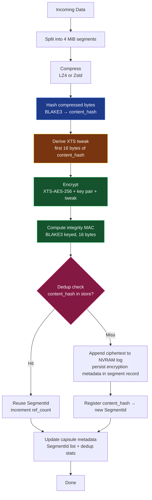

# Encrypted Deduplication Flow

SPACE deduplicates segments that are stored encrypted on disk. The dedup engine never sees ciphertext — it looks up the pre-encryption BLAKE3 content hash. On the classical XTS path that same hash also derives the XTS tweak, so identical plaintext additionally happens to produce identical ciphertext, and a shared on-disk segment is safely readable from any capsule that holds it.

> **⚠️ HybridKyber + dedup is rejected at the pipeline boundary.** Under `advanced-security` + `CryptoProfile::HybridKyber`, the wrapped XTS key is derived by mixing the *originating* `capsule_id` and logical `segment_index` into the BLAKE3 hash (see `derive_material` in [crypto_profiles.rs:139](../../crates/common/src/security/crypto_profiles.rs#L139)). The read path re-derives material using the *reading* capsule's `capsule.id` and its own `seg_index` ([legacy.rs:1638-1641](../../crates/capsule-registry/src/pipeline/legacy.rs#L1638)) — so a dedup hit across capsules (or at a different logical index within one capsule) would yield a different wrapped key and the segment would fail to decrypt. `Policy::validate()` therefore rejects `crypto_profile == HybridKyber && dedupe == true` (see `PolicyError::HybridKyberDedupConflict`). The validation runs at every write entry point: `WritePipeline::write_capsule_with_policy` (facade), `LegacyPipeline::write_capsule_with_policy{,_async}`, the modular `pipeline::Pipeline::write_capsule` (both `phase5` and non-`phase5` builds), and `RegistryPipelineHandle::write_capsule`. Set `dedupe = false` when using HybridKyber, or switch back to `Classical`. Lifting this restriction requires either keying the dedup index on the crypto derivation context or storing the originating context and using it on read.

Source code lives in:

- [`crates/encryption/src/xts.rs`](../../crates/encryption/src/xts.rs) — XTS-AES-256, `derive_tweak_from_hash`
- [`crates/encryption/src/mac.rs`](../../crates/encryption/src/mac.rs) — BLAKE3 keyed MAC
- [`crates/capsule-registry/src/pipeline/legacy.rs`](../../crates/capsule-registry/src/pipeline/legacy.rs) — write pipeline (`Step 3: Encrypt if enabled (before dedup check)`)
- [`crates/capsule-registry/src/dedup.rs`](../../crates/capsule-registry/src/dedup.rs) — `hash_content_with_algo`, content store

## Write path

1. **Segment** — input is split into 4 MiB segments (`common::SEGMENT_SIZE`).
2. **Compress** — LZ4 or Zstd, entropy-aware. Produces `compressed_bytes`.
3. **Hash** — `hash_content_with_algo(compressed_bytes, algo)` → `content_hash` (32 bytes BLAKE3 with algorithm domain separation). This is the dedup key.
4. **Derive XTS tweak** — `derive_tweak_from_hash(content_hash)` takes the first 16 bytes as the tweak.
5. **Encrypt** — XTS-AES-256 over `compressed_bytes` with the key pair from `KeyManager` and the derived tweak. Produces `ciphertext` of the same length.
   - On `CryptoProfile::HybridKyber` (feature `advanced-security`): the XTS key pair is *wrapped per capsule/segment* via ML-KEM (`wrap_xts_key(profile, base, capsule_id, segment_id, content_hash)`) and the tweak is mixed with a per-segment nonce. Ciphertext is *not* deterministic across capsules. See the warning above — dedup hits in this mode currently break the read path.
6. **MAC** — `compute_mac` produces a 16-byte BLAKE3 keyed MAC over `ciphertext + EncryptionMetadata`. The tag is written into the segment's `integrity_tag` field via the segment metadata update in step 7.
7. **Dedup check** — look up `content_hash` in the registry's content store:
   - **Hit** → reuse the existing `SegmentId`, increment `ref_count`. No new bytes written.
   - **Miss** → `nvram.append(seg_id, ciphertext)` writes the ciphertext bytes to the NVRAM log; encryption metadata (`encryption_version`, `key_version`, `tweak_nonce`, `integrity_tag`, and PQ material under `advanced-security`) is then copied into the `Segment` record and persisted via `update_segment_metadata`. Finally, register `content_hash → SegmentId` in the content store.
8. **Capsule update** — append the resolved `SegmentId` and dedup stats to the capsule metadata.

The hash is computed pre-encryption; the dedup *check* runs post-encrypt (matching the `// Step 3: Encrypt if enabled (before dedup check)` comment in `legacy.rs`).

## Read path

1. Fetch segment by `SegmentId`.
2. `verify_mac` over `ciphertext + EncryptionMetadata` using the key version recorded in metadata.
3. Decrypt with XTS-AES-256 using the stored tweak and recovered key pair (ML-KEM unwrap if applicable).
4. Decompress (LZ4 / Zstd / none — branch on `segment.compressed`, not on capsule policy).
5. Return plaintext.

## Why this works

- **Hash-based lookup decouples dedup from encryption.** The content store keys on the pre-encryption hash, so the dedup engine doesn't care whether the on-disk bytes are deterministic ciphertext, randomized ciphertext, or plaintext.
- **Classical XTS bonus property.** When the tweak is derived purely from `content_hash`, identical compressed plaintext under the same key version *also* produces identical ciphertext. This means the dedup'd on-disk segment is safely reusable across capsules — any reader of the shared segment can decrypt it.
- **HybridKyber path — currently incompatible with dedup.** Per-capsule/segment ML-KEM wrap plus nonce-mixed tweak breaks ciphertext-equality across capsules. Worse, the read path independently re-derives the wrapped key from the *reading* capsule's `capsule.id` + `seg_index`, so a dedup hit across capsules (or at a different logical index) produces the wrong key and the segment is unreadable. Either the dedup index must key on the crypto derivation context (so HybridKyber segments only dedupe within an identical context), or the registry must store the originating context and the read path must use it. Until then, dedup should be disabled when HybridKyber is in use.
- **No extra encrypted-dup index.** Same `ContentHash → SegmentId` map serves both unencrypted and encrypted policies.

## Security properties

- **Confidentiality** — XTS-AES-256, hardware-accelerated via AES-NI.
- **Integrity** — 16-byte BLAKE3 keyed MAC over ciphertext + metadata, domain-separated MAC key derived from XTS keys.
- **Key separation** — HKDF with versioned info strings; rotation via key version (old segments stay readable under their recorded version).
- **Algorithm-domain-separated dedup key** — `hash_content_with_algo` prefixes the BLAKE3 input with `b"space.dedup.v1\0algo:" || algo || b"\0"` so segments stored under different compression treatments cannot collide.

## Overhead

Approximately +5% write, +9% read versus unencrypted, on AES-NI-capable hardware (see [README.md](../../README.md) Performance section).

## Flow diagram

Legend: blue = hash (dedup key), amber = deterministic tweak derivation, green = encrypt + MAC, magenta = dedup decision.

## Related docs

- [DEDUP_IMPLEMENTATION.md](DEDUP_IMPLEMENTATION.md) — content store, ref counting, GC
- [ENCRYPTION_IMPLEMENTATION.md](ENCRYPTION_IMPLEMENTATION.md) — XTS, MAC, key manager internals
- [../patentable_concepts.md](../patentable_concepts.md) § 3 — patent claim and implementation note
