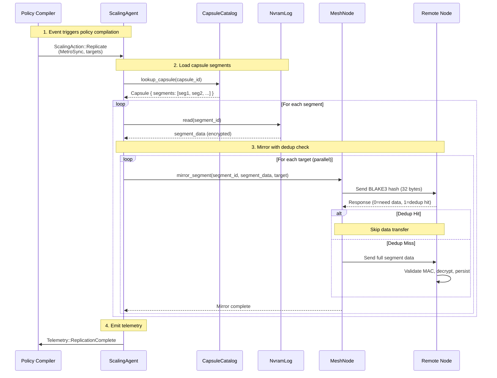
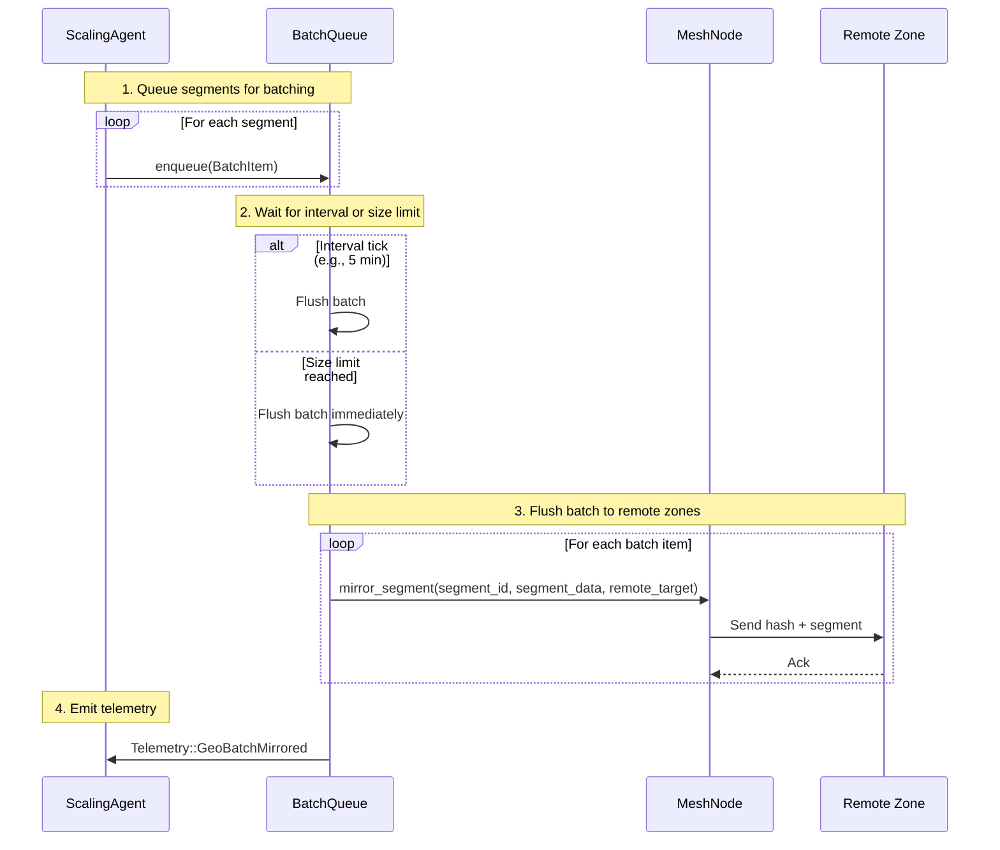
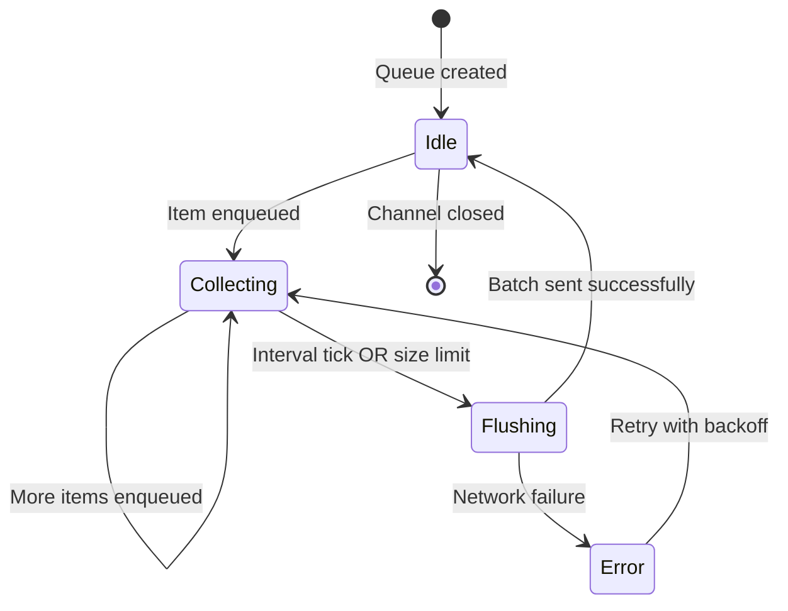
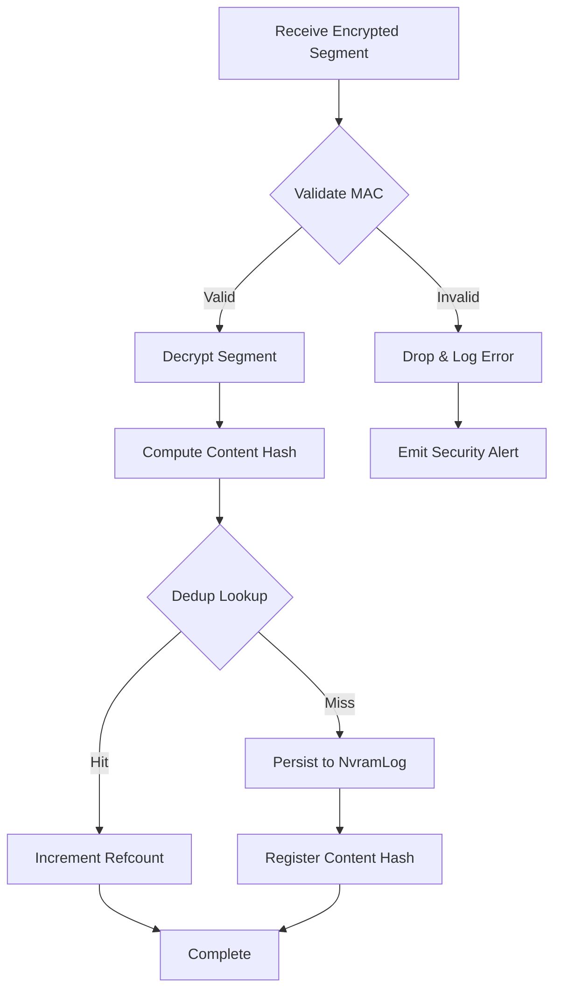

# Materializing Replicas from Policies

This document describes how SPACE executes real replication from policy actions, implementing both metro-sync (zero-RPO) and async geo-replication modes.

## Overview

The SPACE replication system translates declarative policies into actionable replicas through the following components:

- **PolicyCompiler**: Compiles telemetry events and policies into `ScalingAction` enums
- **ScalingAgent**: Executes scaling actions autonomously
- **MeshNode**: Handles peer discovery and segment mirroring
- **BatchQueue**: Implements async batching for geo-replication
- **ReplicationHandler**: Processes inbound segment mirrors with MAC validation and dedup

## Metro-Sync Flow (Zero-RPO)

Metro-sync provides synchronous replication within a metro zone for zero-RPO guarantees.



### Metro-Sync Characteristics

| Property | Value |
|----------|-------|
| **RPO** | Zero (synchronous) |
| **Replica Count** | 2 (configurable) |
| **Zone Scope** | Same metro zone (<2ms latency) |
| **Dedup** | Hash-first check before transfer |
| **Security** | BLAKE3 MAC validation, XTS-AES-256 encryption |

## Async Geo-Replication Flow (Non-Zero RPO)

Async geo-replication batches segments for cross-zone replication with configurable RPO intervals.



### Async Batching Parameters

| Parameter | Default | Description |
|-----------|---------|-------------|
| **flush_interval** | 300s (5 min) | RPO-based batching interval |
| **max_batch_size** | 1000 segments | Force flush if batch grows too large |
| **backpressure_limit** | 1000 items | Queue capacity before blocking |

### Batch Queue Lifecycle



## Dedup-Preserving Mirror Protocol

The mirror protocol ensures deduplication is preserved during replication by sending the content hash first.

### Wire Protocol

```
1. Client → Server: BLAKE3 hash (32 bytes)
2. Server → Client: Response (1 byte)
   - 0x00: Need full data (dedup miss)
   - 0x01: Dedup hit (skip transfer)
3. If 0x00:
   Client → Server: Full segment data (encrypted)
```

### Protocol Example

```rust
// Outbound (mirror_segment in MeshNode)
let hash = blake3::hash(segment_data);
stream.write_all(hash.as_bytes()).await?;

let mut response = [0u8; 1];
stream.read_exact(&mut response).await?;

if response[0] == 1 {
    // Dedup hit - skip transfer
    return Ok(());
}

// Dedup miss - send full data
stream.write_all(segment_data).await?;
```

```rust
// Inbound (ReplicationHandler)
let mut hash = [0u8; 32];
stream.read_exact(&mut hash).await?;

if content_store.lookup_content(&ContentHash(hash)) {
    // Dedup hit
    stream.write_all(&[1]).await?;
    return Ok(());
}

// Dedup miss - expect full data
stream.write_all(&[0]).await?;
// ... receive and process full segment
```

## Integration with PODMS Components

### Policy Compilation

```rust
// Example: Zero-RPO policy triggers metro-sync
let policy = Policy {
    rpo: Duration::ZERO,  // Zero-RPO
    latency_target: Duration::from_millis(2),
    sovereignty: SovereigntyLevel::Zone,
    ..Default::default()
};

// Telemetry event
let event = Telemetry::NewCapsule {
    id: capsule_id,
    policy: policy.clone(),
    node_id: Some(current_node),
};

// Compiler generates actions
let actions = compiler.compile_scaling_actions(&event, &policy, &mesh_state);
// → [ScalingAction::Replicate {
//      capsule_id,
//      strategy: ReplicationStrategy::MetroSync { replica_count: 2 },
//      targets: [node1, node2]
//    }]

// Force async RPO policies (e.g., hourly snapshots) to run immediately
let force = Telemetry::ForcePolicyExecution {
    capsule_id,
    forced_rpo: Some(Duration::ZERO), // or None to honor the capsule policy
};
```

### Agent Execution

```rust
// ScalingAgent consumes telemetry and executes actions with production handles
let runtime = capsule_registry::runtime::RuntimeHandles::from_env()?;
let agent = runtime.build_scaling_agent(mesh_node, default_policy);
agent.run(telemetry_rx).await?;

// Internally:
// 1. Receive telemetry event
// 2. Compile to ScalingAction
// 3. Execute action (e.g., metro-sync replication)
// 4. Update registry and emit completion telemetry
```

## Security Guarantees

| Layer | Mechanism | Purpose |
|-------|-----------|---------|
| **Integrity** | BLAKE3 MAC | Detect tampering/corruption during transport |
| **Confidentiality** | XTS-AES-256 | Protect data in transit and at rest |
| **Authentication** | Key version validation | Ensure only authorized nodes can decrypt |
| **Dedup** | Post-decryption hashing | Preserve dedup without exposing plaintext |
| **DoS Protection** | Frame size limits (16MB) | Prevent resource exhaustion |

### MAC Validation Flow



## Peer Discovery and Target Selection

### Current Approach (Manual Registration)

```rust
// Manual peer registration for POC
mesh_node.register_peer(peer_id, socket_addr).await;

// Discover registered peers
let peers = mesh_node.discover_peers().await?;
```

### Future: Gossip-Based Discovery (Planned)

The system is designed to integrate with gossip protocols (e.g., memberlist) for dynamic peer discovery:

```rust
// Planned gossip integration
let gossip = Memberlist::new(gossip_config).await?;
let peers = gossip.alive_nodes_in_zone(current_zone).await?;

// Zone-aware selection
let metro_peers = peers.filter(|p| p.zone == ZoneId::Metro { name: "us-west" });
```

### Target Selection Criteria

1. **Sovereignty constraints**: Respect policy sovereignty level (Local, Zone, Global)
2. **Latency requirements**: Select nodes within latency target (<2ms for metro)
3. **Capacity**: Ensure targets have sufficient storage capacity
4. **Zone awareness**: Prefer same-zone nodes for metro-sync

## Testing Strategy

### Unit Tests

```bash
# Test metro-sync execution
cargo test --package scaling test_metro_sync_execution

# Test async queue batching
cargo test --package scaling test_batch_queue_interval_flush

# Test dedup protocol
cargo test --package scaling test_dedup_preserving_mirror
```

### Integration Tests (Multi-Node)

```bash
# Start 3 nodes in Docker
docker-compose up --scale nodes=3

# Trigger replication policy
spacectl set-policy --capsule <id> --rpo 0

# Verify replicas
spacectl verify-replicas --capsule <id> --expected 2
```

### Fault Injection

```rust
// Test network failure during replication
// Expected: Retry with backoff
simulate_network_partition(node1, node2);
trigger_replication(capsule_id);
verify_eventual_consistency();

// Test node failure during batch flush
// Expected: Batch persisted and retried
kill_node(remote_node);
trigger_geo_replication(capsule_id);
verify_batch_queued();
```

## Performance Characteristics

| Metric | Metro-Sync | Async Geo |
|--------|------------|-----------|
| **Latency** | <2ms (intra-zone) | 5-300s (batched) |
| **Throughput** | ~500 MB/s (TCP) | Batched (1000 segments/flush) |
| **Dedup Savings** | Hash-first check (32 bytes vs full segment) | Same |
| **Network Efficiency** | Per-segment connection | Batched connections |
| **CPU Overhead** | BLAKE3 hash + MAC validation | Same + batching logic |

### Optimization Notes

- **Zero-copy potential**: Replace TCP with RDMA verbs for <1µs latency
- **Batching efficiency**: 5-min batches reduce connection overhead by ~99%
- **Dedup hit rate**: Typical 30-50% dedup hit rate saves 50% bandwidth

## Troubleshooting

### Common Issues

| Symptom | Likely Cause | Solution |
|---------|--------------|----------|
| Replication not executing | Policy not compiled | Check telemetry events reaching agent |
| Dedup miss on known data | Hash mismatch | Verify encryption key versions match |
| Batch queue backpressure | Network congestion | Increase flush interval or add targets |
| MAC validation failures | Key version mismatch | Sync key manager across nodes |

### Debug Commands

```bash
# Check agent status
spacectl agent status

# View batch queue depth
spacectl queue stats

# Inspect replication telemetry
spacectl telemetry --filter ReplicationComplete

# Verify dedup content store
spacectl dedup stats --node <node_id>
```

## Future Enhancements

1. **Gossip Integration**: Replace manual peer registration with memberlist-based discovery
2. **Persistent Queue**: Use sled or similar for durable async batching (survive restarts)
3. **RDMA Transport**: Replace TCP with RDMA verbs for <1µs zero-copy transfers
4. **Adaptive Batching**: Dynamically adjust flush interval based on network conditions
5. **Multi-zone EC**: Implement erasure coding for cross-zone replication (5+2 parity)
6. **Telemetry Enrichment**: Add detailed metrics (segment transfer time, dedup hit rate, etc.)

## References

- [Policy Compiler Spec](./compiler.md)
- [PODMS Architecture](./phase3.md)
- [Encryption and MAC Validation](./encryption.md)
- [NvramLog Design](./nvram-sim.md)
