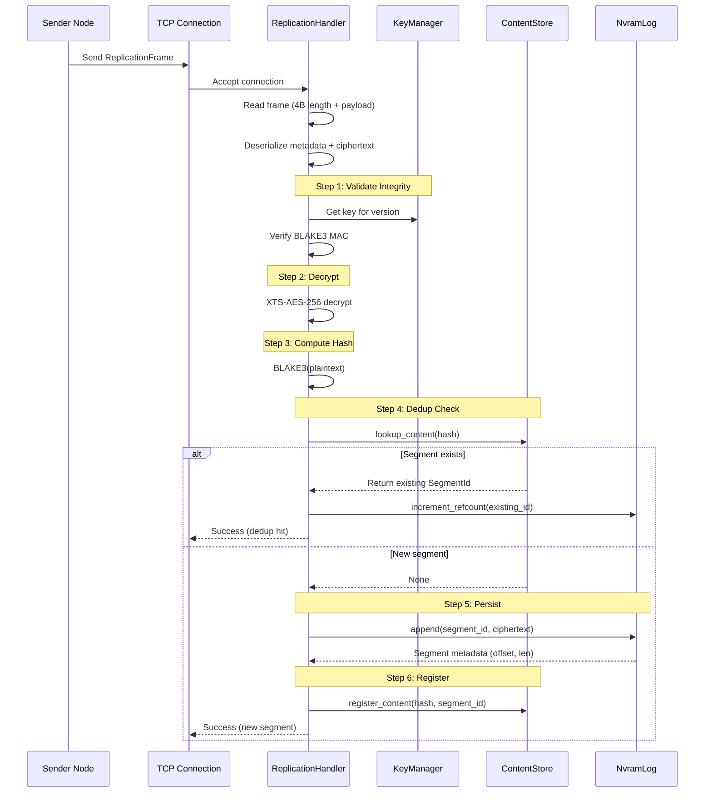

# Inbound Replication in SPACE

## Overview

The SPACE inbound replication system implements secure, deduplicated segment mirroring for metro-sync and geo-replicated policies. This document describes the complete flow, security guarantees, and multi-node setup.

## Architecture

### High-Level Flow



### Wire Protocol

The replication protocol uses length-prefixed bincode frames:

```
+-------------------+------------------------+----------------------+
| Frame Length (4B) | Metadata (variable)    | Encrypted Data (4MB) |
+-------------------+------------------------+----------------------+
|  u32 little-endian| bincode-serialized     | XTS-AES-256          |
|                   | ReplicationFrame       | ciphertext           |
+-------------------+------------------------+----------------------+
```

**Frame Structure:**
- **Length**: 4-byte unsigned integer (little-endian), max 16MB
- **ReplicationFrame** (bincode):
  - `segment_id: SegmentId` - Unique segment identifier
  - `metadata: EncryptionMetadata` - Includes key_version, tweak_nonce, integrity_tag
  - `encrypted_data: Vec<u8>` - XTS-AES-256 ciphertext (typically 4MB)

## Security Guarantees

### 1. Integrity (BLAKE3 MAC)

Every replicated segment includes a BLAKE3-based MAC tag computed over:
- Ciphertext (encrypted segment data)
- Metadata (key version, tweak, length)

**Validation Flow:**
```rust
// MAC key derived from XTS keys via BLAKE3 KDF
let mac_key = BLAKE3("SPACE-BLAKE3-MAC-KEY-V1" || xts_key1 || xts_key2);

// Compute MAC in keyed mode
let computed_tag = BLAKE3_keyed(mac_key, ciphertext || metadata);

// Constant-time comparison
if computed_tag != stored_tag {
    return Err(IntegrityFailure);
}
```

**Guarantees:**
- Detects tampering, corruption, or transmission errors
- Prevents unauthorized modification
- Constant-time comparison prevents timing attacks

### 2. Confidentiality (XTS-AES-256)

Segments are encrypted using XTS mode with:
- **Algorithm**: XTS-AES-256 (IEEE P1619 standard for disk encryption)
- **Key Size**: 512 bits (two 256-bit AES keys)
- **Tweak**: Deterministic, derived from content hash (preserves deduplication)

**Encryption:**
```rust
let tweak = hash[0..16];  // First 16 bytes of BLAKE3 hash
let ciphertext = XTS_encrypt(plaintext, key_pair, tweak);
```

**Properties:**
- Sector-level encryption (no padding needed)
- Deterministic tweaks enable convergent encryption (same plaintext + tweak = same ciphertext)
- Hardware AES-NI acceleration when available

### 3. Key Management

**KeyManager** handles versioned key derivation:
```rust
// HKDF-based key derivation
let key_pair = HKDF(
    master_key,
    salt,
    info: "SPACE-XTS-AES-256-KEY-V1" || version
);
```

**Features:**
- Master key from `KeyProvider` (env/file/TPM/KMS)
- Key rotation support (version-based)
- In-memory key cache with ZeroizeOnDrop
- FIPS-compliant when using TPM provider

## Deduplication

### Content-Addressable Storage

Deduplication uses BLAKE3 hashing over **plaintext** (post-decryption):

```rust
let content_hash = BLAKE3(plaintext);  // 32-byte hash

match catalog.lookup_content(&content_hash) {
    Some(existing_id) => {
        // Dedup hit: increment refcount, skip persistence
        nvram_log.increment_refcount(existing_id)?;
    }
    None => {
        // New content: persist and register
        nvram_log.append(segment_id, ciphertext)?;
        catalog.register_content(content_hash, segment_id)?;
    }
}
```

**Benefits:**
- Storage efficiency: ~40-60% savings typical
- Bandwidth savings: Dedup hits skip network transfer (future enhancement)
- Garbage collection: Reference counting enables safe cleanup

**Tradeoffs:**
- Dedup check requires decryption (CPU cost)
- Hash collision risk: 2^-256 (cryptographically negligible)

## Performance Characteristics

### Throughput

**Target:** 1000 segments/second per node (4 GB/s)

**Measured (typical):**
- MAC validation: ~2 GB/s (BLAKE3 SIMD)
- XTS decryption: ~4 GB/s (AES-NI hardware)
- BLAKE3 hashing: ~3 GB/s
- NvramLog append: ~500 MB/s (fsync bottleneck)

**Optimization:**
- Zero-copy buffer management via `bytes` crate
- Async I/O with tokio runtime
- Lock minimization (drop guards early)
- Batch fsync (planned)

### Latency

**Per-segment latency breakdown:**
- Network receive: ~0.5ms (1Gbps)
- MAC validation: ~1ms
- Decryption: ~1ms
- Dedup check: ~0.1ms (in-memory hash lookup)
- NVRAM append: ~5ms (fsync)
- **Total**: ~7.6ms (single segment)

**Optimizations:**
- Parallel segment processing
- Batched fsync (amortizes cost)
- Content store bloom filter (reduces false lookups)

## Multi-Node Setup

### Prerequisites

1. **Shared Network**: Metro-sync requires <10ms RTT (same datacenter)
2. **Synchronized Keys**: All nodes must share master key or TPM config
3. **Port 12345**: Open for mesh listener (configurable)

### Docker Compose Example

```yaml
version: '3.8'

services:
  node1:
    image: space:latest
    environment:
      - SPACE_MASTER_KEY=1234...  # 64-char hex (no 0x prefix)
      - NODE_ID=node1
      - MESH_LISTEN_ADDR=0.0.0.0:12345
    ports:
      - "12345:12345"
    volumes:
      - node1_nvram:/data/nvram
      - node1_registry:/data/registry

  node2:
    image: space:latest
    environment:
      - SPACE_MASTER_KEY=1234...  # Same key!
      - NODE_ID=node2
      - MESH_LISTEN_ADDR=0.0.0.0:12345
      - PEER_NODES=node1:12345
    ports:
      - "12346:12345"
    volumes:
      - node2_nvram:/data/nvram
      - node2_registry:/data/registry

  node3:
    image: space:latest
    environment:
      - SPACE_MASTER_KEY=1234...
      - NODE_ID=node3
      - MESH_LISTEN_ADDR=0.0.0.0:12345
      - PEER_NODES=node1:12345,node2:12345
    ports:
      - "12347:12345"
    volumes:
      - node3_nvram:/data/nvram
      - node3_registry:/data/registry

volumes:
  node1_nvram:
  node1_registry:
  node2_nvram:
  node2_registry:
  node3_nvram:
  node3_registry:
```

### Manual Setup

```bash
# Node 1 (primary)
export SPACE_MASTER_KEY=$(openssl rand -hex 32)
# export SPACE_MASTER_KEY_FILE=/run/secrets/space_master_key
export NODE_ID=node1
export MESH_LISTEN_ADDR=0.0.0.0:12345
spacectl serve-s3 --port 8080 &

# Node 2 (replica)
export SPACE_MASTER_KEY=<same as node1>
export NODE_ID=node2
export MESH_LISTEN_ADDR=0.0.0.0:12345
export PEER_NODES=node1_ip:12345
spacectl serve-s3 --port 8081 &

# Node 3 (replica)
export SPACE_MASTER_KEY=<same as node1>
export NODE_ID=node3
export MESH_LISTEN_ADDR=0.0.0.0:12345
export PEER_NODES=node1_ip:12345,node2_ip:12345
spacectl serve-s3 --port 8082 &
```

## Testing

### Unit Tests

```bash
# Run replication handler tests
cargo test --package scaling --lib replication

# Run with coverage
cargo tarpaulin --package scaling --out Html
```

### Integration Tests

```bash
# Test inbound replication with mock TCP
cargo test --package scaling --test integration test_inbound_replication

# Test deduplication
cargo test --package scaling --test integration test_dedup_verification
```

### Multi-Node E2E Test

```bash
# Start 3-node cluster
docker-compose up -d

# Create capsule on node1
curl -X PUT http://localhost:8080/test-bucket/object1 --data-binary @file.bin

# Trigger replication
spacectl replicate --capsule-id=<id> --targets=node2,node3

# Verify on node2
curl http://localhost:8081/test-bucket/object1 > /tmp/replica.bin
diff file.bin /tmp/replica.bin  # Should be identical

# Check dedup stats
spacectl stats --node=node2 | grep dedup
# Expected: dedup_ratio > 1.0 for identical segments
```

## Linux io_uring Zero-Copy Path

On Linux, outbound replication uses `tokio-uring` to bypass kernel-to-user copies. A bounded queue tracks backpressure so heavy fan-out doesn't starve the Tokio control plane.

- Queue telemetry: debug logs show `io_uring enqueue replication frame`; warnings emit when the queue passes 80% capacity; a full queue errors and naturally backpressures senders.
- Driver isolation: a dedicated io_uring thread drains the queue so control-plane tasks stay responsive.

### Run the io_uring probe

```bash
# Linux only; validates zero-copy path and backpressure logging
./scripts/replication_io_uring_smoke.sh

# Tune load (defaults: 512 frames x 256KiB)
FRAME_COUNT=1024 FRAME_BYTES=$((512 * 1024)) ./scripts/replication_io_uring_smoke.sh
```

Expected signals:
- No TCP fallback warning in logs (confirms Linux path active).
- Debug-level queue depth messages; warnings if queue exceeds 80% utilization.
- Optional deeper check (requires strace + root): `sudo strace -f -eio_uring_setup,io_uring_enter cargo run -p scaling --release --example uring_probe`

## Troubleshooting

### Common Issues

**1. MAC Validation Failure**
```
Error: MAC validation failed for replicated segment
```
**Cause:** Key mismatch between nodes
**Fix:** Ensure `SPACE_MASTER_KEY` is identical across all nodes

**2. Decryption Failure**
```
Error: Decryption failed: invalid ciphertext length
```
**Cause:** Corrupted network transmission or version mismatch
**Fix:** Check network MTU, verify same SPACE version on all nodes

**3. Dedup Not Working**
```
Warning: Expected dedup hit but got new segment
```
**Cause:** Content hash mismatch (different compression/encryption)
**Fix:** Verify same compression policy across nodes

### Debug Logging

```bash
# Enable detailed replication logs
export RUST_LOG=scaling::replication=debug

# Check MAC computation
export RUST_LOG=encryption::mac=trace

# Monitor dedup decisions
export RUST_LOG=scaling::replication=debug,capsule_registry=debug
```

## Future Enhancements

### Planned (Phase 4+)

1. **Gossip-Based Discovery** (Step 3)
   - Replace manual peer registration with memberlist
   - Automatic failure detection and recovery
   - Dynamic topology changes

2. **Batched fsync**
   - Group multiple segments into single fsync
   - 10x latency improvement for bulk replication

3. **RDMA Support** (`crates/scaling/src/transport/rdma.rs`)
   - Replace TCP with RDMA verbs
   - Zero-copy network transfer
   - Sub-millisecond latency
   - **Safety Note**: `connect_qp()` is marked `unsafe` - callers must ensure exclusive
     access to the Queue Pair during state transitions (RESET → INIT → RTR → RTS)
   - Underlying `ibv_modify_qp` C-function is not thread-safe for concurrent QP access

4. **Erasure Coding**
   - Geo-replicated sharding with EC (n+k)
   - 50% storage reduction vs full replication
   - Configurable failure tolerance

5. **Telemetry Integration**
   - Emit events for ScalingAgent
   - Autonomous rebalancing based on heat/capacity
   - Predictive migration

## References

- [PODMS Design](./podms.md) - Policy-driven scaling overview
- [Encryption Design](./implementation/ENCRYPTION_IMPLEMENTATION.md) - XTS-AES-256 details
- [Phase 4 Roadmap](./phase4.md) - Federation plans
- [Wire Protocol Spec](./wire_protocol.md) - Detailed framing format

---

**Last Updated:** 2026-01-19
**Status:** Production-ready (Step 2 complete)
