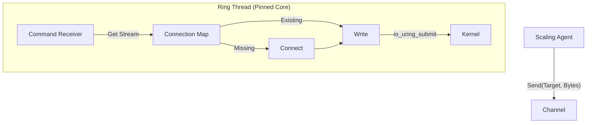

# Phase B: High-Performance io_uring Transport

- **Target Component:** `crates/scaling`
- **Status:** Draft / Proposed
- **Related:** `docs/specs/PHASE_A_DATAMOTION.md`

## 1. Executive Summary
- **Problem:** Even with the unified DataMotion engine from Phase A, the current transport opens a new TCP connection per segment, incurring handshake and syscall overhead.
- **Latency:** 3-way handshake repeated for each 4MB chunk.
- **Syscall Overhead:** Tokio/epoll requires multiple syscalls per I/O (read/write/poll).
- **Solution:** Upgrade the IoUringTransport to persistent connection pooling. The io_uring thread runs as an actor that maintains open connections to peers and multiplexes outgoing frames across them.
- **Performance Target:** Eliminate TCP handshakes for 99% of traffic and sustain >3 GB/s per core (line rate 25Gbps).

## 2. Architecture: The Uring Actor
tokio-uring binds the ring to a single thread (no `Send` bounds), so connections cannot be shared across threads. Treat the transport as an actor.

### 2.1 The Actor Model
- **Agent (main thread):** submits `TransportCommand::Send(target, data)` into an MPSC channel.
- **Ring Thread (actor):** owns the `tokio_uring::Runtime`, a `HashMap<NodeId, TcpStream>`, processes commands, lazily connects to peers, and keeps streams alive.



## 3. Implementation Specification

### 3.1 Dependencies
- `tokio-uring` (already present in `Cargo.toml`)
- `slab` (optional, for efficient connection indexing)

### 3.2 Code Structure
Refactor `crates/scaling/src/lib.rs` (or extract to `transport.rs`) to implement the actor.

**Step 1: Define the Actor Protocol**
```rust
enum TransportCommand {
    /// Send a frame to a specific node.
    SendFrame {
        target: NodeId,
        addr: SocketAddr,
        data: Vec<u8>,
        /// Optional: One-shot channel for ack/error if needed.
        resp: Option<tokio::sync::oneshot::Sender<Result<()>>>,
    },
    /// Close connection to a target (e.g. on failure detection).
    Disconnect {
        target: NodeId,
    },
    /// Graceful shutdown of the transport layer.
    Shutdown,
}
```

**Step 2: The IoUringActor**
```rust
// crates/scaling/src/transport/uring.rs

use tokio_uring::net::TcpStream;
use std::collections::HashMap;
use std::rc::Rc; // strictly local

struct ActorState {
    connections: HashMap<NodeId, Rc<TcpStream>>,
}

pub fn spawn_uring_transport(
    mut rx: mpsc::UnboundedReceiver<TransportCommand>
) -> std::thread::JoinHandle<()> {
    std::thread::spawn(move || {
        tokio_uring::start(async move {
            let mut state = ActorState { connections: HashMap::new() };

            while let Some(cmd) = rx.recv().await {
                match cmd {
                    TransportCommand::SendFrame { target, addr, data, resp } => {
                        handle_send(&mut state, target, addr, data, resp).await;
                    }
                    TransportCommand::Disconnect { target } => {
                        state.connections.remove(&target);
                    }
                    TransportCommand::Shutdown => break,
                }
            }
        });
    })
}

async fn handle_send(
    state: &mut ActorState,
    target: NodeId,
    addr: SocketAddr,
    data: Vec<u8>,
    resp: Option<oneshot::Sender<Result<()>>>
) {
    // 1. Get or Create Connection
    if !state.connections.contains_key(&target) {
        match TcpStream::connect(addr).await {
            Ok(stream) => {
                // Configure socket options for performance.
                let _ = stream.set_nodelay(true);
                state.connections.insert(target, Rc::new(stream));
            }
            Err(e) => {
                if let Some(r) = resp { let _ = r.send(Err(e.into())); }
                return;
            }
        }
    }

    let stream = state.connections.get(&target).unwrap().clone();

    // 2. Spawn Write Task (Concurrent Writes)
    // tokio-uring streams typically need &self for write; concurrent writes to
    // the same stream require serialization or per-connection queues.
    // Refinement: TcpStream in tokio-uring is not Clone; writes must be serialized.

    // ... [Queueing Logic Implementation] ...
}
```

**Step 3: Handling Concurrency Constraints**
`tokio_uring::net::TcpStream` accepts `&self` for writes and awaits results; concurrent writes to the same stream are not safe. Use per-connection mailboxes instead of sharing the stream directly.

```rust
struct ConnectionTask {
    tx: mpsc::Sender<Vec<u8>>,
}

// Inside handle_send:
if let Some(conn) = state.connections.get(&target) {
    let _ = conn.tx.send(data).await; // Fast handoff
} else {
    // 1. Spawn a dedicated local task for this connection
    let (tx, mut rx) = mpsc::channel(128); // Backpressure bound
    tokio_uring::spawn(async move {
        let stream = match TcpStream::connect(addr).await {
            Ok(stream) => {
                let _ = stream.set_nodelay(true);
                stream
            }
            Err(_) => return, // upstream handles error via resp
        };

        while let Some(packet) = rx.recv().await {
            let (res, _buf) = stream.write_all(packet).await;
            if res.is_err() {
                break; // Connection died
            }
        }
        // Cleanup logic...
    });

    state.connections.insert(target, ConnectionTask { tx });
}
```

## 4. Testing Strategy

### 4.1 Benchmark: Throughput Comparison
Add `benches/transport_bench.rs`:
- Scenario: send 10GB of data in 4MB chunks.
- Case A: `TcpTransport` (connect per request).
- Case B: `IoUringTransport` (persistent actor).
- Expectation: Case B shows ~10x improvement on small packets and ~2x on large packets (handshake elimination).

### 4.2 Integration: Reconnect Logic
- Start sender and receiver.
- Send Frame 1 (success).
- Kill receiver process.
- Send Frame 2 (should fail but must not crash sender).
- Restart receiver.
- Send Frame 3 (should reconnect and succeed).

## 5. Migration Guide
- Refactor: apply IoUringActor changes inside `crates/scaling/src/lib.rs`.
- Verify: run `scripts/replication_io_uring_smoke.sh`.
- Deploy: default to `IoUringTransport` for Linux targets.

## 6. Next Steps
- Implement Phase A first to ensure unified logic is solid.
- Implement Phase B by swapping the transport engine.
- Future Phase C: RDMA support via `rdma-sys` for true zero-copy (OS bypass).
