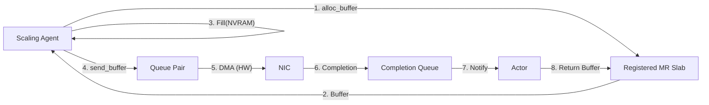

# Phase C: Zero-Copy RDMA Transport

- **Target Component:** `crates/scaling`
- **Status:** Draft / Proposed
- **Related:** `docs/specs/PHASE_B_IO_URING_TRANSPORT.md`

## 1. Executive Summary
- **Problem:** Phase B (io_uring) removed syscall overhead but still routes data through the kernel TCP/IP stack, consuming CPU for packetization, checksumming, and copies across user/kernel space.
- **Throughput Ceiling:** CPU-bound around ~25Gbps per core.
- **Latency Floor:** ~10–20µs due to scheduling and interrupt handling.
- **Solution:** Add an RDMA (Remote Direct Memory Access) backend using `rdma-sys` (libibverbs). Hardware DMAs segments directly from the NvramLog buffer of the source node into destination memory, bypassing CPU and kernel.
- **Performance Target:** Line-rate 100Gbps+ with <1% CPU; <5µs latency for 4KB messages.

## 2. Architecture: The Verbs Interface
RDMA uses verbs, registered memory, and queue pairs (QPs); we must expose memory-aware APIs instead of copying `Vec<u8>` buffers.

### 2.1 Refactoring DataTransport for Zero-Copy
```rust
// New Trait Definition
#[async_trait]
pub trait ZeroCopyTransport: Send + Sync {
    /// Request a buffer from the transport's pre-registered memory pool.
    async fn alloc_buffer(&self, size: usize) -> RegisteredBuffer;

    /// Send a pre-registered buffer. Returns ownership of the buffer on completion.
    async fn send_buffer(
        &self,
        target: NodeId,
        buffer: RegisteredBuffer,
    ) -> Result<RegisteredBuffer>;
}

pub struct RegisteredBuffer {
    pub data: Vec<u8>, // or BytesMut
    pub lkey: u32,     // Local Key for RDMA access
    pub mr_handle: *mut ibv_mr,
}
```

### 2.2 The RDMA Actor
Like Phase B, an actor polls the RDMA Completion Queue (CQ) instead of io_uring.



## 3. Implementation Specification

### 3.1 Dependencies
```toml
[target.'cfg(target_os = "linux")'.dependencies]
rdma-sys = "0.3"  # Bindings to libibverbs / librdmacm
bytes = "1.0"     # Efficient buffer management
```

### 3.2 Component Breakdown
**A. MemoryRegionPool**
- Pin a large slab (e.g., 1GB) at startup via `mmap` with `MAP_LOCKED`.
- Register the entire slab with `ibv_reg_mr()`.
- Sub-allocate slices for segments to avoid hot-path registrations.

**B. RdmaTransport Struct**
```rust
pub struct RdmaTransport {
    context: *mut ibv_context,
    pd: *mut ibv_pd,        // Protection Domain
    cq: *mut ibv_cq,        // Completion Queue
    cm_id: *mut rdma_cm_id, // Connection Manager ID
    peers: RwLock<HashMap<NodeId, QueuePair>>, // NodeId -> QP
}
```

**C. Connection Management (RC - Reliable Connected)**
- Use RC transport for ordered, reliable delivery (TCP-like semantics in hardware).
- Handshake via `rdma_cm` to resolve addresses and routes.
- Transition QP states: `INIT -> RTR -> RTS`.
- Exchange `rkey` during handshake for future one-sided verbs; start with two-sided Send/Recv.

### 3.3 The Send Loop
`send_buffer` posts a work request and waits on CQ completion.
- Build `ibv_send_wr` referencing buffer address and `lkey`.
- Ring doorbell via `ibv_post_send()`.
- Suspend future until CQ poller reports `WC_SUCCESS`, then return buffer ownership.

## 4. Integration with DataMotion (Phase A)
Update the Unified Engine to operate on registered memory.
```rust
// ScalingAgent::execute_data_motion
let mut buffer = self.transport.alloc_buffer(SEGMENT_SIZE).await;
self.nvram_log.read_into(segment_id, &mut buffer.data).await?;
// Optional: in-place crypto transform
self.transport.send_buffer(target, buffer).await?;
```

## 5. Testing Strategy (SoftRoCE)
GitHub Actions and laptops usually lack InfiniBand; validate with the RXE (SoftRoCE) kernel module.

### 5.1 CI Setup (`scripts/setup_softroce.sh`)
```bash
#!/bin/bash
modprobe rdma_rxe
rdma link add rxe0 type rxe netdev eth0
ibv_devinfo  # Verify soft device exists
```

### 5.2 Unit Tests
- `test_memory_registration`: allocate buffer, register MR, assert `lkey > 0`.
- `test_loopback_send`: create two QPs on `rxe0`, send a message, expect completion success.

## 6. Migration Guide
- Detect RDMA capability (`/dev/infiniband/uverbs0`) in the agent.
- Fallback order: RDMA -> IoUringTransport (Linux) -> TcpTransport (others).

## 7. Next Steps
- Add `rdma-sys` dependency to `Cargo.toml`.
- Refactor `NvramLog` to support `read_into(&mut [u8])` for zero-copy reads.
- Build `examples/rdma_ping_pong.rs` to validate verbs wrapper before full integration.
