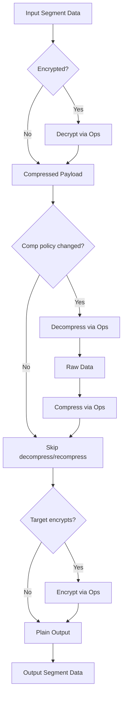

# PODMS Swarm Behavior Spec

Status: Draft  
Component: `crates/common` (Swarm Intelligence)

## 1. Problem Statement
- `common` owns `Capsule`, `Policy`, and the PODMS-facing `SwarmBehavior` trait.
- The compression/encryption crates depend on `common`.
- `Capsule::apply_transform` must invoke compression/encryption, creating a dependency cycle if `common` links those crates directly.
- We need capsules to re-encrypt/re-compress during migration without breaking crate boundaries.

## 2. Transformer Pattern (Dependency Inversion)
`common` declares an interface (`TransformOps`) for the heavy cryptography/compression work. Higher-level runtimes (e.g., scaling/pipeline agents) implement this trait and inject it when performing a migration. This lets `common` orchestrate the policy logic without owning the concrete implementations.

```rust
pub trait TransformOps {
    fn decrypt(
        &self,
        capsule_id: CapsuleId,
        data: &[u8],
        policy: &EncryptionPolicy,
        ctx: SegmentId,
    ) -> Result<Vec<u8>>;
    fn encrypt(
        &self,
        capsule_id: CapsuleId,
        data: &[u8],
        policy: &EncryptionPolicy,
        ctx: SegmentId,
    ) -> Result<Vec<u8>>;
    fn decompress(&self, data: &[u8], policy: &CompressionPolicy) -> Result<Vec<u8>>;
    fn compress(&self, data: &[u8], policy: &CompressionPolicy) -> Result<Vec<u8>>;
}
```

`capsule_id` is forwarded into crypto ops so runtime implementations can derive per-capsule keys. See `docs/specs/PODMS_TRANSFORM_OPS.md` for the concrete SwarmOps adapter.

## 3. Data Flow: Unwrap -> Transcode -> Rewrap


### Short-Circuit Optimization
- If `source.compression == target.compression`, we treat the payload as opaque and skip the decompress/re-compress cycle.
- Re-encryption always honors the target policy (key rotation/zone-context), even when policies are equal.

## 4. Sovereignty Enforcement
- `Local`: never leave the node. `on_migrate` returns `SOVEREIGNTY VIOLATION`.
- `Zone`: may move between nodes within the same zone (callers validate zone equality; the capsule logs intent).
- `Global`: unrestricted.

## 5. SwarmBehavior Interface
- `apply_transform`: accepts `segment_id`, source data, target `Policy`, and a `TransformOps` implementation. Executes the unwrap -> transcode -> rewrap pipeline described above.
- `on_migrate`: enforces sovereignty before any bytes leave the node.
- `requires_transform`: returns true when crossing zone boundaries (zone-aware re-keying) or when the caller detects policy drift.

## 6. Implementation Notes (common crate)
- Lives under `#[cfg(feature = "podms")]` in `crates/common/src/lib.rs`.
- Helpers `Capsule::is_encrypted` / `is_compressed` rely on the policy enums.
- Error surface for local violations: `"SOVEREIGNTY VIOLATION: ... denied."`

## 7. Usage Example
```rust
// In a scaling agent (implements TransformOps)
let ops = PipelineOps::new(registry, key_manager);

let transformed = capsule.apply_transform(
    segment_id,
    original_bytes,
    &target_policy,
    &ops,
)?;
```

## 8. Testing Hooks
- Mock `TransformOps` reverses buffers to prove decrypt->encrypt symmetry.
- Migration guard test asserts `Local` sovereignty rejects outbound moves.

## 9. Scaling Runtime Integration
- Implement `TransformOps` in the scaling/pipeline runtime (e.g., `PipelineOps`) that delegates to the encryption/compression crates.
- Pass the ops into `capsule.apply_transform(segment_id, data, target_policy, &ops)` during migration/replication.
- Keeps `common` free of crypto/compression dependencies while enabling full unwrap->transcode->rewrap orchestration.
