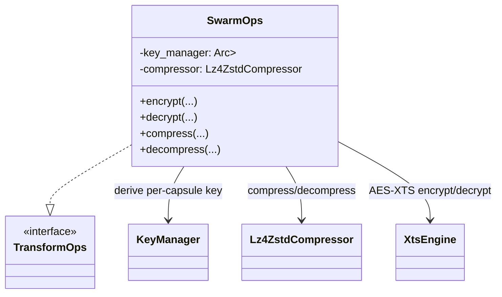

# PODMS Transform Ops Specification

Status: Draft  
Component: `crates/scaling` (`SwarmOps`)  
Implements: `crates/common::podms::TransformOps`

## 1. Purpose
- Provide the concrete runtime adapter that bridges PODMS policy orchestration (`common`) to the crypto/compression engines (`encryption`, `compression`).
- Carry `capsule_id` into encryption so keys are derived per capsule (Zero Trust requirement).
- Keep `common` free of heavy dependencies while enabling decrypt -> decompress -> recompress -> re-encrypt during migrations.

## 2. Interface (updated)
`TransformOps` now forwards the capsule context into crypto methods:
```rust
pub trait TransformOps {
    fn decrypt(
        &self,
        capsule_id: CapsuleId,
        data: &[u8],
        policy: &EncryptionPolicy,
        ctx: SegmentId,
    ) -> Result<Vec<u8>>;
    fn encrypt(
        &self,
        capsule_id: CapsuleId,
        data: &[u8],
        policy: &EncryptionPolicy,
        ctx: SegmentId,
    ) -> Result<Vec<u8>>;
    fn decompress(&self, data: &[u8], policy: &CompressionPolicy) -> Result<Vec<u8>>;
    fn compress(&self, data: &[u8], policy: &CompressionPolicy) -> Result<Vec<u8>>;
}
```
`Capsule::apply_transform` now passes `self.id` into `ops.encrypt/decrypt`, ensuring per-capsule keys are always derivable.

## 3. Architecture


## 4. Crypto path (Envelope Encryption)
- **Per-capsule key**: `KeyManager::get_key(version)` (defaults to current) -> BLAKE3 XOF keyed by `[key1 || key2 || capsule_id || version]` -> `XtsKeyPair`. This guarantees unique keys per capsule even when versions match.
- **Segment key (convergent)**: `segment_key = BLAKE3_XOF("SPACE::SEGMENT_KEY_V1" || content_hash)`; payload is encrypted with this key to preserve deduplication.
- **Wrapped key**: the segment key is wrapped with the capsule key using a BLAKE3-keyed stream and stored in `EncryptionMetadata::wrapped_segment_key`.
- **Tweak**: `SegmentId` is encoded little-endian into 16 bytes and used as the XTS tweak so identical blocks in different segments encrypt differently.
- **Encryption**: `xts::encrypt(plaintext, segment_key, tweak)`; metadata captures `key_version`, `tweak`, `ciphertext_len`, `wrapped_segment_key`, and MAC.
- **Decryption**: unwrap segment key with the capsule key; decrypt ciphertext with the unwrapped segment key. If metadata lacks the wrapped key (legacy), fallback decrypt uses the capsule key directly.
- **Rotation**: callers set `key_version` in policy; `None` uses the KeyManager's current version so migrations re-wrap keys without re-encrypting data.

## 5. Compression path
- Stateless `Lz4ZstdCompressor` handles `CompressionPolicy::{LZ4, Zstd, None}`.
- Decompression uses algorithm strings (`lz4:{level}`, `zstd:{level}`) so future levels remain forward-compatible.

## 6. Failure surfaces
- Unsupported encryption policy variant: error (migration aborts safely).
- Compression codec errors (invalid frame, level out of range) are surfaced with context.
- Key derivation errors include the requested version to aid debugging/telemetry.

## 7. Implementation snapshot (`crates/scaling/src/swarm_ops.rs`)
```rust
pub struct SwarmOps {
    key_manager: Arc<RwLock<KeyManager>>,
    compressor: Lz4ZstdCompressor,
}

fn derive_capsule_key(&self, capsule_id: CapsuleId, key_version: Option<u32>) -> Result<XtsKeyPair> {
    let mut manager = self.key_manager.blocking_write();
    let version = key_version.unwrap_or_else(|| manager.current_version());
    let base = manager.get_key(version)?.clone();
    drop(manager);

    let mut derived = [0u8; XTS_KEY_SIZE];
    Hasher::new()
        .update(base.key1())
        .update(base.key2())
        .update(capsule_id.as_uuid().as_bytes())
        .update(&version.to_le_bytes())
        .finalize_xof()
        .fill(&mut derived);
    Ok(XtsKeyPair::from_bytes(derived))
}
```

## 8. Usage
```rust
use scaling::SwarmOps;
use std::sync::Arc;
use tokio::sync::RwLock;

let key_manager = Arc::new(RwLock::new(KeyManager::new(master)));
let ops = SwarmOps::new(key_manager);
let migrated = capsule.apply_transform(segment_id, &payload, &target_policy, &ops)?;
```

### Runtime wiring
- `ScalingAgent::migrate_capsule_task` constructs `SwarmOps` from the shared `KeyManager` and uses it to decrypt -> decompress -> recompress -> re-encrypt segments before emitting replication frames, ensuring per-capsule keys and fresh MACs on every outbound migration/evacuation. Segment keys are convergent and wrapped per capsule; frames now include the capsule id and wrapped key so receivers unwrap safely.

## 9. Tests
- `encrypt_decrypt_round_trip`: validates SwarmOps round-trips through XTS with tweaks.
- `per_capsule_keys_produce_unique_ciphertext`: verifies ciphertext differs across capsules.
- `compression_round_trip`: ensures Zstd path compresses/decompresses via the adapter.

## 10. Related docs
- `docs/specs/PODMS_SWARM_BEHAVIOR.md` — high-level swarm pattern.
- `docs/podms.md` — capsule and agent wiring with the updated TransformOps signature.
