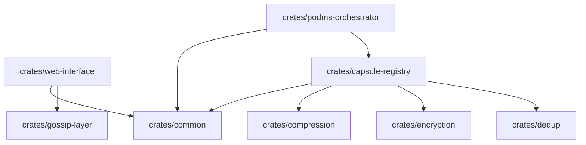

# SPACE Architecture & Design Specification

Project: SPACE (Storage Platform for Adaptive Computational Ecosystems)  
Version: 1.3  
Status: Draft  
Scope: Formalizes current codebase patterns with emphasis on the modular monolith layout and the web-interface MVC split.

## 1. Executive Summary
- SPACE is a modular monolith built with a Rust workspace to isolate domains while keeping a single deployable unit.
- Crate boundaries prevent god-objects and enforce narrow, testable interfaces.
- The web-interface crate implements strict MVC: Axum controllers, a shared model state, and Leptos-based views compiled to WASM.

## 2. High-Level Architecture: Modular Monolith
- Workspace contracts: each crate owns a domain; cross-crate access flows only through published traits and DTOs.
- Common abstractions (traits, shared types) live in `crates/common`; higher-level crates depend on these abstractions, not on each other.
- Pipelines (compression, encryption, dedupe) are composed in `crates/capsule-registry`, while orchestration and policy live in `crates/podms-orchestrator`.

### 2.1 Crate Dependency Graph


### 2.2 Core Component Boundaries
| Crate | Responsibility | Design Pattern |
| --- | --- | --- |
| `common` | Shared types (e.g., `Capsule`, `Policy`) and traits (`Compressor`, `StorageBackend`). | Interface segregation; contracts without implementations. |
| `capsule-registry` | Core I/O and pipeline orchestration across compression, encryption, and dedupe. | Pipeline pattern. |
| `web-interface` | Operator UI plus REST API. | MVC with feature-gated Leptos frontend. |
| `podms-orchestrator` | Policy enforcement, scaling, and telemetry reactions. | Observer/sidecar reacting to mesh events. |

### 2.3 Transport Evolution
- Present: Tokio TCP transport with persistent connection pooling for replication.
- Phase B (Linux): io_uring transport runs as a dedicated actor with per-peer mailboxes and pooled TCP streams to remove connect/write/close churn; see `docs/specs/PHASE_B_IO_URING_TRANSPORT.md`.
- Phase C (Linux optional): RDMA verbs backend with registered buffer pool and completion-queue actor for zero-copy replication; see `docs/specs/PHASE_C_RDMA_TRANSPORT.md`.
- Fallback: Non-Linux builds retain the Tokio TCP path while sharing the same replication protocol.

## 3. Core Abstractions & Interface Patterns
SPACE uses traits as ports and adapters to decouple orchestration from implementation. Storage engines, compressors, and cryptography providers can be swapped or mocked without touching pipeline logic.

### 3.1 Compressor Trait (`crates/common/src/traits.rs`)
- Purpose: abstract entropy detection, algorithm choice (LZ4 vs Zstd), and integrity verification.
- Contract:
```rust
pub trait Compressor: Send + Sync {
    fn compress<'a>(
        &'a self,
        data: &'a [u8],
        policy: &CompressionPolicy,
    ) -> Result<(Cow<'a, [u8]>, CompressionSummary)>;

    fn decompress(&self, data: &[u8], algorithm: &str) -> Result<Vec<u8>>;
}
```
- Implementation strategy:
  - Adaptive behavior: implementations (e.g., `Lz4ZstdCompressor` in `crates/compression`) honor `CompressionPolicy`, selecting the backend or skipping compression when entropy is high.
  - Zero-copy preference: returning `Cow<'a, [u8]>` lets compressors hand back the original slice when compression is skipped.

### 3.2 StorageBackend Trait (`crates/common/src/traits.rs`)
- Purpose: isolate the pipeline from physical persistence so simulators (`sim-nvram`) and SPDK drivers share the same orchestration.
- Contract:
```rust
pub trait StorageBackend: Send + Sync {
    type Transaction: StorageTransaction;

    fn append<'a>(&'a mut self, segment: SegmentId, data: &'a [u8]) -> BoxFuture<'a, Result<()>>;
    fn read(&self, segment: SegmentId) -> BoxFuture<'_, Result<Vec<u8>>>;
    fn begin_txn(&mut self) -> BoxFuture<'_, Result<Self::Transaction>>;
}
```
- Transactional atomicity: the associated `Transaction` keeps segment writes and metadata (e.g., dedupe counters) consistent; failed pipeline stages roll back.
- Decoupling benefits: pipeline tests inject mocks; production swaps in SPDK-backed implementations with no changes to `WritePipeline`.

## 4. Shared Library Strategy & Reusability
The workspace favors single-source-of-truth libraries for core logic and types to avoid DTO drift and circular dependencies.

### 4.1 `common`: shared vocabulary
- Zero workspace dependencies; importable everywhere.
- Shared types: `Capsule`, `SegmentId`, `CapsuleId`, and `Policy` (including `CompressionPolicy`, `EncryptionPolicy`).
- Design impact: the web-interface can deserialize policy JSON using the same structs the registry enforces, eliminating API/internal drift.
```rust
// crates/common/src/lib.rs
pub struct Capsule {
    pub id: CapsuleId,
    pub policy: Policy, // shared definition
    // ...
}
```

### 4.2 `compression`: isolated adaptive logic
- Encapsulates entropy estimation and algorithm selection behind a simple API.
- Consumers request compression; the crate decides whether to compress and which algorithm to use.
- Reuse scenarios: storage engines compress segments; RPC layers compress payloads; CLI tools decompress artifacts offline.
```rust
// crates/compression/src/lib.rs
pub fn adaptive_compress<'a>(
    data: &'a [u8],
    policy: &CompressionPolicy,
) -> Result<(Cow<'a, [u8]>, CompressionResult)> {
    // entropy check -> choose algo -> compress -> verify
}
```

## 5. Web Layer Design: MVC Pattern (`crates/web-interface`)
The management plane is a classical server-side MVC adapted for a reactive WASM frontend.

### 5.1 Model (`src/state.rs`)
- Source of truth container: `AppState` holds Arc/RwLock-backed collections plus a command channel to the mesh.
- Business objects: `StoredFile` (file artifact) and `Peer` (mesh node) reside here.
- Command pattern: intents are expressed via `MeshCommand` variants (e.g., `StoreFile`, `RefreshPeers`) sent over `mesh_tx`.
- Dependency injection: gossip is an `Arc<dyn GossipHandler>`, allowing real or mocked implementations in tests.
- Key structure (abridged):
```rust
// crates/web-interface/src/state.rs
pub struct AppState {
    pub gossip: Arc<dyn GossipHandler>,          // injected gossip layer
    pub mesh_tx: mpsc::UnboundedSender<MeshCommand>, // command channel to mesh tasks
    pub peers: Arc<RwLock<Vec<Peer>>>,           // mutable peer cache
    // also holds metrics, websocket connections, and file store
}
```

### 5.2 View (`src/frontend/mod.rs`)
- Pure rendering: Leptos components render HTML from reactive signals; no business logic executes in the browser.
- Passive data flow: signals (e.g., `peers_data`) are populated by controller fetches and simply drive `view!` templates.
- Isolation: compiled under `#[cfg(feature = "frontend")]`, preventing backend state from leaking into the client build.
```rust
// crates/web-interface/src/frontend/mod.rs
#[component]
fn PeersSection(peers_data: ReadSignal<Option<PeersResponse>>) -> impl IntoView {
    // Pure rendering based on provided signal
    view! { /* table markup omitted for brevity */ }
}
```

### 5.3 Controller (`src/api/mod.rs`)
- Traffic cop: Axum routes validate input, translate it to commands, and return DTOs for the view.
- Model interaction: controllers send mesh commands (`MeshCommand::RefreshPeers`, `MeshCommand::StoreFile { ... }`) instead of mutating state directly.
- DTO mapping: converts internal types (e.g., `Peer`) into outward-facing responses (`PeersResponse`, `FileResponse`).
```rust
// crates/web-interface/src/api/mod.rs
async fn upload_file(
    State(state): State<AppState>,
    Json(request): Json<UploadRequest>,
) -> Result<Json<FileResponse>, StatusCode> {
    let content = base64::engine::general_purpose::STANDARD
        .decode(&request.content)
        .map_err(|_| StatusCode::BAD_REQUEST)?;
    let hash = blake3::hash(&content).to_hex().to_string();
    let size = content.len() as u64;
    let uploaded_at = std::time::SystemTime::now()
        .duration_since(std::time::UNIX_EPOCH)
        .unwrap()
        .as_secs();
    let file = StoredFile {
        path: request.path.clone(),
        size,
        content,
        hash: hash.clone(),
        uploaded_at,
    };

    state
        .mesh_tx
        .send(MeshCommand::StoreFile { file })
        .map_err(|_| StatusCode::INTERNAL_SERVER_ERROR)?;

    state
        .mesh_tx
        .send(MeshCommand::BroadcastGossip {
            topic: "data_ops".into(),
            msg: GossipMessage::FileUploaded {
                path: request.path,
                size,
                uploader: "web-interface".into(),
                hash: hash.clone(),
            },
        })
        .ok();

    Ok(Json(FileResponse {
        success: true,
        message: "File uploaded successfully".into(),
        hash: Some(hash),
    }))
}
```

## 6. Design Principles Adherence
- **Dependency Inversion (DIP):** high-level logic depends on `GossipHandler` and other traits from `mesh_core`, not on concrete gossip implementations (`AppState` only knows the trait object).
- **Single Responsibility (SRP):** model manages state/commands; controllers translate HTTP to model commands; views render data without side effects.
- **Open/Closed (OCP):** extend the system by adding `MeshCommand` variants and trait impls; existing routes and views remain stable aside from new wiring/UI widgets.

## 7. Implementation Guidelines for Contributors
- **Adding features:**
  1. Model: add capability to `AppState`/`MeshCommand` in `src/state.rs`.
  2. Controller: expose a new route in `src/api/mod.rs` that issues the command or reads state.
  3. View: fetch the new route and render the data in `src/frontend/mod.rs`.
- **Testing strategy:**
  - Model: use `MockGossipHandler` or other test doubles in `state.rs` tests.
  - Controller: exercise routes with `axum::test_helpers`/`axum-test`.
  - View: keep components presentational to minimize logic-heavy testing (snapshots or hydration checks only if needed).

## 8. Technical Debt & Refactoring: Pipeline Evolution (`crates/capsule-registry`)
Context: `WritePipeline` currently bundles legacy synchronous logic and modular/async paths behind nested `#[cfg]` branches, making it hard to read and test.

### 8.1 Problem Statement
- `WritePipeline` acts as a god-object with feature-flagged fields (NVRAM logging, key manager, modular delegations, telemetry).
- Methods like `write_capsule` change behavior based on compile-time flags, complicating reasoning and coverage.

### 8.2 Strategy Pattern Refactor
- Define a runtime-polymorphic interface:
```rust
#[async_trait::async_trait]
pub trait PipelineStrategy: Send + Sync {
    async fn write_capsule(&self, data: &[u8], policy: &Policy) -> Result<CapsuleId>;
    async fn read_capsule(&self, id: CapsuleId) -> Result<Vec<u8>>;
    async fn delete_capsule(&self, id: CapsuleId) -> Result<()>;
}
```
- Extract concrete strategies:
  - `LegacyPipeline`: existing synchronous flow, NVRAM looping, local key management.
  - `ModularPipeline`: delegates to registry pipeline/runtime handles.
- Convert `WritePipeline` into a facade selecting an implementation at construction (factory pattern):
```rust
pub struct WritePipeline {
    inner: Box<dyn PipelineStrategy>,
}

impl WritePipeline {
    pub fn new(use_modular: bool, deps: Deps) -> Self {
        let inner: Box<dyn PipelineStrategy> = if use_modular {
            Box::new(ModularPipeline::new(deps.clone()))
        } else {
            Box::new(LegacyPipeline::new(deps))
        };
        Self { inner }
    }
}
```
- Runtime switch can use env/config (`SPACE_USE_MODULAR=1`) instead of recompiling with feature flags.

### 8.3 Benefits
- Separation of concerns: legacy and modular logic live in distinct files/structs.
- Simplified testing: instantiate concrete strategies directly without juggling Cargo features.
- Runtime configurability: switch implementations without rebuilding.

## 9. Resilience & Snapshot Testing Strategy (Draft)
- Goal: deterministic chaos/resilience coverage for `crates/scaling` and `crates/podms-orchestrator` beyond happy-path replication.
- ForceSnapshot control: new telemetry variant `ForcePolicyExecution { capsule_id, forced_rpo }` lets the scaling agent bypass schedulers and run RPO actions immediately. Exposed via `spacectl snapshot trigger` for operator-driven runs.
- Failover harness: lightweight two-node `MeshNode` setup to mirror segments, drop the primary, and verify the secondary serves clean data (metro-sync zero RPO).
- Recovery playbooks:
  - **Snap-and-Recover**: async RPO policies are forced via telemetry, local corruption is injected, and read-repair fetches from the remote replica.
  - **Move-and-Recover**: snapshots can be repointed to a new node/zone and hydrated on first access.
- Test assets: `crates/scaling/tests/resilience_test.rs` encodes the metro-sync failover check and forced snapshot compilation flow; future work adds corruption+repair once the read-repair pipeline is wired end-to-end.
